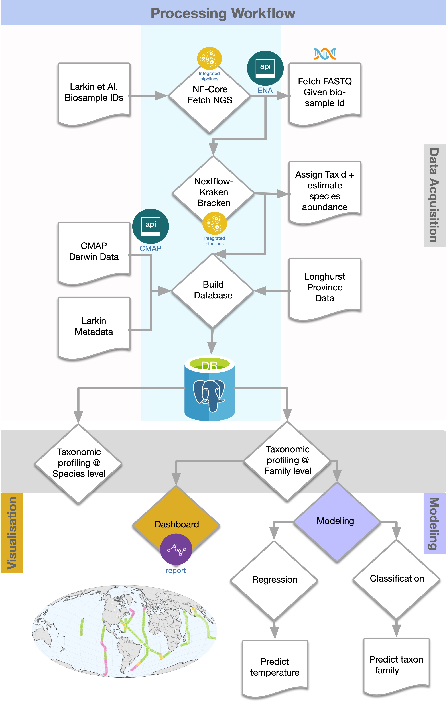
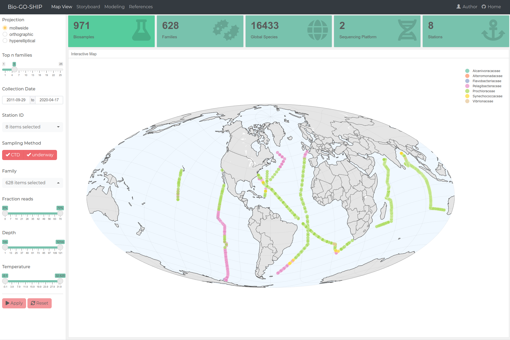

# marine-microbiome

An interactive dashboard that builds upon the publication by Larkin et al., 
“High spatial resolution global ocean metagenomes from Bio-GO-SHIP repeat hydrography transects.”

This dashboard address the question, **“who is where?”** To achieve this, 
the raw metagenomic sequence reads deposited at NCBI under the umbrella project PRJNA656268 were analyzed. 

# Processing worflow

Detailed processing workdlow of the data

# Dashboard screenshot

# Online Version

https://alakob.shinyapps.io/biogoship/
