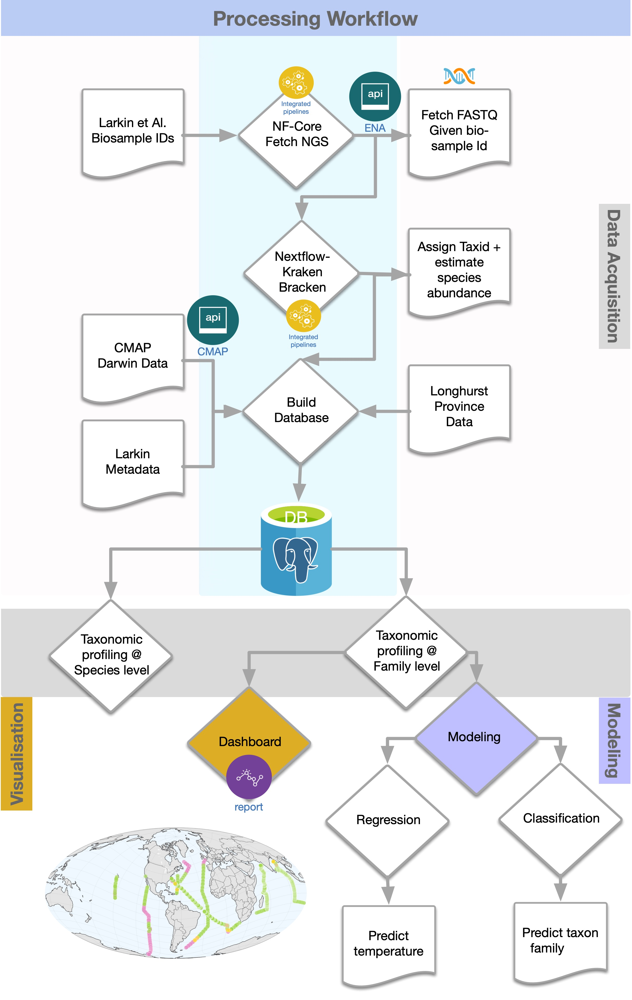

```{r setup, include=FALSE}
library(knitr)        # Report Graphics
library(flexdashboard)
library(shiny)
library(shinyWidgets)
library(shinyjs)

# Core
library(tidyverse)
library(lubridate)
library(dbplyr)       # Database back-end for dplyr

# Database
library(odbc)
library(RSQLite)

#Theme
library(hrbrthemes)
library(tidyquant)
# Interactive Visualizations
library(plotly)

```

```{r}
########################################################
#      RETRIEVE DATA FROM SQLite DATABASE
########################################################

connection <- dbConnect(RSQLite::SQLite(), "00_data/marine_db.db")
# dbListTables(connection)
# Tables of interest ...
family_results <- tbl(connection, "marine_families")
software_versions_tbl <- tbl(connection, "software_versions") %>%  collect()
 
# family_results <- read_rds("marine.rds") %>%  sample_frac(size=.1)
global_species_number <- 16433


family_results <- family_results  %>% collect() %>%  sample_frac(size=.1)
#family_results %>%  glimpse()

marine_tbl <- family_results %>% 
    mutate(taxon_name=taxon_name %>%
               str_trunc(width=16, side="right")) %>% 
    group_by(biosample_id) %>% 
    arrange(desc(fraction_total_reads)) %>%
    slice_min(n=100000, 
              order_by=desc(fraction_total_reads)) %>%
    #mutate(taxon_name= taxon_name %>% as_factor() %>%  fct_reorder(fraction_total_reads)) %>% 
    ungroup() %>% 
    mutate(col_date = ymd(col_date)) %>% 
        mutate(temperature = case_when(is.na(temperature) ~ 25.73,
                                       TRUE ~ temperature)) 

#max(marine_tbl$col_date)
#smin(marine_tbl$col_date)
```

Sidebar {.sidebar}
=======================================================================

```{r}
useShinyjs(rmd=TRUE)

shinyWidgets::awesomeRadio(
   inputId = "map_projection",
   label = h6("Projection"), 
   choices = c("mollweide", "orthographic","hyperelliptical"),
   selected = "mollweide",
   status = "warning"
)

sliderInput(inputId = "top_n_family",
            label   = h6("Top n families"),
            min = 1,
            max = 25, 
            value = 5, 
            step = 1, 
            round = TRUE)


dateRangeInput(
  inputId = "date_range", 
  label   = h6("Collection Date"),
  start   = min(marine_tbl$col_date), 
  end     = max(marine_tbl$col_date), 
  min     = min(marine_tbl$col_date),  
  max     = max(marine_tbl$col_date),  
  startview = "month")

 
shinyWidgets::pickerInput(
   inputId  = "section_name", 
   label    = h6("Cruises"), 
   choices   = unique(marine_tbl$section_id), 
   selected  = unique(marine_tbl$section_id), 
   multiple = TRUE,
   options  = list(
     `actions-box` = TRUE,
     size = 10,
     `selected-text-format` = "count > 3"
   )
 )


shinyWidgets::checkboxGroupButtons(
    inputId   = "sample_method", 
    label     = h6("Sampling Method"), 
    choices   = unique(marine_tbl$sample_method), 
    selected  = unique(marine_tbl$sample_method), 
    checkIcon = list(
     yes = icon("ok", lib = "glyphicon"),
     no  = icon("remove", lib = "glyphicon")
   ))

 
shinyWidgets::pickerInput(
   inputId  = "taxon_name", 
   label    = h6("Family"), 
   choices   = unique(marine_tbl$taxon_name), 
   selected  = unique(marine_tbl$taxon_name), 
   multiple = TRUE,
   options  = list(
     `actions-box` = TRUE,
     size = 10,
     `selected-text-format` = "count > 3"
   )
 )
 

sliderInput(inputId = "slider_input",
            label   = h6("Total reads"),
            min = round(min(marine_tbl$fraction_total_reads) * 100 , digits=0),
            max = round(max(marine_tbl$fraction_total_reads) * 100, digits=0), 
            value = c(0,round(max(marine_tbl$fraction_total_reads) * 100, digits=0)), 
            step = 1, 
            round = TRUE,
            post  = "%")

sliderInput(inputId = "slider_input_2",
            label   = h6("Depth"),
            min = min(marine_tbl$depth),
            max = max(marine_tbl$depth), 
            value = c(0,max(marine_tbl$depth)), 
            step = 1, 
            round = TRUE,
            post  = "m")

sliderInput(inputId = "slider_input_3",
            label   = h6("Temperature"),
            min = min(marine_tbl$temperature),
            max = max(marine_tbl$temperature), 
            value = c(min(marine_tbl$temperature) ,max(marine_tbl$temperature)), 
            step = 1, 
            round = TRUE,
            post  = "")

hr()

actionButton(inputId = "apply", label ="Apply", icon = icon("play"))
actionButton(inputId = "reset", label = "Reset", icon = icon("sync"))
 
observeEvent(eventExpr = input$reset, handlerExpr = {
 
 updateAwesomeRadio(
    session  = session,
    inputId  = "map_projection",
    selected =  "mollweide"
 )
 
 updateKnobInput(
    session  = session,
    inputId  = "top_n_family",
    value = 5  
 )
 
 updateCheckboxGroupButtons(
    session  = session,
    inputId  = "sample_method",
    selected = unique(marine_tbl$sample_method))

  updatePickerInput(
    session = session,
    inputId = "taxon_name",
    selected = unique(marine_tbl$taxon_name))
  
  updatePickerInput(
    session = session,
    inputId = "section_name",
    selected = unique(marine_tbl$section_id))
  
  updateDateRangeInput(
    session = session,
    inputId = "date_range",
    start   = min(marine_tbl$col_date), 
    end     = max(marine_tbl$col_date))
  
  updateSliderInput(
      session=session,
      inputId="slider_input",
      value = c(0,round(max(marine_tbl$fraction_total_reads) * 100, digits=0))
  )
  
  updateSliderInput(
      session=session,
      inputId="slider_input_2",
      value = c(0,max(marine_tbl$depth))
  )
  updateSliderInput(
      session=session,
      inputId="slider_input_3",
      value = c(min(marine_tbl$temperature), max(marine_tbl$temperature))
  )
  
  shinyjs::delay(ms=100, expr={
    shinyjs::click(id="apply")
  })


})

```

Map View
===================================== 

Row
-------------------------------------

```{r}

AE1319      <- 'https://www.bco-dmo.org/deployment/537979'
AMT28       <- 'https://cchdo.ucsd.edu/cruise/74JC20180923'
BVAL46      <- 'https://www.bco-dmo.org/dataset/829843'
C13.5.A13.5 <- 'https://cchdo.ucsd.edu/cruise/33RO20200321'
I07N        <- 'https://cchdo.ucsd.edu/cruise/33RO20180423'
I09N        <- 'https://cchdo.ucsd.edu/cruise/33RR20160321'
NH1418      <- 'https://www.bco-dmo.org/deployment/829909'
P18         <- 'https://cchdo.ucsd.edu/cruise/33RO20161119'

marine_filtered_tbl <- eventReactive(eventExpr = input$apply, 
                                     valueExpr = {
            marine_tbl %>% 
                mutate(links= case_when(
                    str_detect(section_id, 'AE1319') ~ paste0('<a target=_blank href="', AE1319, '">',"AE1319",'</a>'),
                    str_detect(section_id, 'AMT28') ~ paste0('<a target=_blank href="', AMT28, '">',"AMT28",'</a>'),
                    str_detect(section_id, 'BVAL46') ~ paste0('<a target=_blank href="', BVAL46, '">',"BVAL46",'</a>'),
                    str_detect(section_id, 'C13.5.A13.5') ~ paste0('<a target=_blank href="', C13.5.A13.5, '">',"C13.5/A13.5",'</a>'),
                    str_detect(section_id, 'I07N') ~ paste0('<a target=_blank href="', I07N, '">',"I07N",'</a>'),
                    str_detect(section_id, 'I09N') ~ paste0('<a target=_blank href="', I09N, '">',"I09N",'</a>'),
                    str_detect(section_id, 'NH1418') ~ paste0('<a target=_blank href="', NH1418, '">',"NH1418",'</a>'),
                    str_detect(section_id, 'P18') ~ paste0('<a target=_blank href="', P18, '">',"P18",'</a>'),
                    TRUE ~ section_id
                    )) %>% 
                filter(col_date %>%
                           between(left  = input$date_range[1],
                                   right = input$date_range[2])) %>% 
                filter(section_id %in% input$section_name) %>% 
                filter(sample_method %in% input$sample_method) %>% 
                filter(taxon_name %in% input$taxon_name) %>% 
                filter(fraction_total_reads %>%  
                           between(left  = (input$slider_input[1])/100,
                                   right = (input$slider_input[2])/100)) %>% 
                filter(depth %>%  
                           between(left  = input$slider_input_2[1],
                                   right = input$slider_input_2[2])) %>% 
                filter(temperature %>%  
                           between(left  = input$slider_input_3[1],
                                   right = input$slider_input_3[2]))

                                         
            },
            ignoreNULL = FALSE
)

summary_filtered_tbl <- reactive({
    marine_filtered_tbl()  %>% 
        summarise( sample_metric  = unique(biosample_id) %>%  length(),
                   taxon_metric   = unique(taxon_name) %>% length(),
                   platform_metric = unique(platform_strategy) %>% length(),
                   section_metric = unique(section_id) %>%  length(),
                   species_metric = global_species_number)
})

```

### Biosamples {.value-box}
```{r}
renderValueBox({
    valueBox(
        value = summary_filtered_tbl()$sample_metric,
        icon= "fa-flask",
        color="success")
})
```

### Families {.value-box}
```{r}
renderValueBox({
    valueBox(
        value   = summary_filtered_tbl()$taxon_metric,
        icon = "fa-bacteria",
        color = "primary"
    )
})
```

### Global Species {.value-box}
```{r}
renderValueBox({
    valueBox(
        value   = summary_filtered_tbl()$species_metric,
        icon = "fa-globe",
        color = "primary"
    )
})
```

### Sequencing Platform {.value-box}
```{r}
renderValueBox({
    valueBox(
        value   = summary_filtered_tbl()$platform_metric,
        icon = "fa-dna",
        color = "primary"
    )
})
```

### Cruises {.value-box}
```{r}
renderValueBox({
    valueBox(
        value   = summary_filtered_tbl()$section_metric,
        icon = "fa-anchor",
        color = "primary"
    )
})
```

Row {data-height=850}
-----------------------------------------------------------------------

### Interactive Map  {data-width=850}

```{r}
column_2_string <- function(df, col_name){
    col_name_var_expr <- enquo(col_name)
    new_col <- df %>%  
        pull(!!col_name_var_expr) %>% 
        str_c(.,"\n") %>%  toString(., width=NULL) %>% 
        gsub(", ","",.)
    df$col2string <- new_col
    return(df)
}

geo_plot_tbl <- reactive({
    marine_filtered_tbl() %>% 
    
    group_by(biosample_id) %>% arrange(desc(fraction_total_reads)) %>%
    slice_min(n=input$top_n_family, order_by=desc(fraction_total_reads)) %>%
    
    mutate(taxon_reads= str_c(taxon_name, ": ", round(fraction_total_reads *100, digits = 2),"%")) %>% 
    ungroup() %>% 
    group_by(biosample_id) %>%  
    nest()  %>%  mutate(data_fixed = data %>%  map(column_2_string, taxon_reads)) %>%
    unnest(data_fixed) %>%  
    select(-data) %>% 
    #group_by(biosample_id) %>%                                           #??
    arrange(desc(fraction_total_reads)) %>% 
    dplyr::filter(fraction_total_reads == max(fraction_total_reads)) %>% #??
    slice_min(n=1, order_by = desc(fraction_total_reads)) %>% 
    #mutate(top1_family_name = taxon_name) %>%                            #??
    mutate(label_text = paste0("Biosample id: ", biosample_id,
                               "\nRun accession: ", run_accession,
                               #"\nTop family Fraction reads: ", 
                               #round(top1_family_fraction_total_reads, digits = 2) * 100, "%",
                               "\nTotal number of families: ", family_number,
                               "\nTotal number of species: ", species_number,
                               "\nTop 1 family: ",top1_family_name, ": ",round(top1_family_fraction_total_reads*100, digits = 2), "%",
                               "\n",
                               "\nNext Top ",input$top_n_family, " Families, %reads\n-------------------------------------\n",
                               col2string)) %>% 
    ungroup() %>% 
    distinct()
    
})


# renderPrint(geo_plot_tbl() %>%  glimpse())
# light grey boundaries
# Projection type
#'mollweide',mollweide, orthographic, mercator, azimuthal, conic, cylindrical, hyperelliptical


# light grey boundaries grey100
l <- list(color = toRGB("white"), width = 0.5)


output$world_map <- renderPlotly( expr ={
        p <- geo_plot_tbl() %>% plot_geo() %>%
        add_markers(y = ~lat, x = ~lon, 
                    size = ~species_number, color = ~top1_family_name, 
                    text = ~label_text,
                    marker = list(line = l)
        ) %>% 
        colorbar(title = 'Top 1 Family') %>% 
        layout(
            showlegend = TRUE, geo = list(
                    showland = TRUE,
                    showlakes = TRUE,
                    showcountries = TRUE,
                    showocean = TRUE,
                    showcoastline = FALSE,
                    showframe = FALSE,
                    countrywidth = 0.5,
                    landcolor = toRGB("grey90"),  #90EE90
                    lakecolor = toRGB("white"),
                    oceancolor = toRGB("#F0F8FF"),
                    projection = list(
                        type = input$map_projection, #'mollweide', #projection_type, #'mollweide', #
                        rotation = list(
                            lon = -60,
                            lat = 20,
                            roll = 0
                        )
                    ),
                    lonaxis = list(
                        showgrid = TRUE,
                        gridcolor = toRGB("gray40"),
                        gridwidth = 0.1
                    ),
                    lataxis = list(
                        showgrid = TRUE,
                        gridcolor = toRGB("gray40"),
                        gridwidth = 0.1
                    )
                ),
                hoverlabel=list(bordercolor="white")
        )

    }

)

plotlyOutput(outputId = "world_map")

```

Row {data-height=150}
-----------------------------------------------------------------------

### Cruises Metadata

```{r}

cruise_metadata_tbl <- reactive({
    marine_filtered_tbl() %>%
        select(links) %>%
        distinct() %>%
        pull(links) %>%  matrix(.) %>%  t(.) %>%  as_tibble(.)
})

DT::renderDataTable(cruise_metadata_tbl(),
                fillContainer = FALSE, escape = FALSE,
                colnames = rep("", ncol(cruise_metadata_tbl())),
                rownames = FALSE,
                autoHideNavigation	= TRUE,
                editable = TRUE,
                options = list(dom = 't')
)


```

Storyboard {.storyboard}
=====================================================

### Processing Workflow (Static)
```{r,  out.height='1000', out.width='1000'}

```


### Raw Feature distribution (Static)
```{r,  out.height='1000', out.width='1000'}

```


### Families Distribution (Interactive)
```{r}
output$density_plot <- renderPlotly(expr={
    p1 <- geo_plot_tbl() %>% 
       select(-c(taxon_name,fraction_total_reads)) %>% 
    distinct() %>% 
    mutate(section_id = as_factor(section_id) %>% fct_reorder(lat)
    ) %>%
    ggplot(aes(x=top1_family_fraction_total_reads,
               #group=top1_family_name,
               fill=top1_family_name,
               color=top1_family_name
               )) +
    geom_density( alpha=.5) +
    facet_wrap(~section_id, scales = "free", ncol = 4) +
    labs(fill=NULL, x="% Total reads") +
    theme(legend.position="bottom") + guides(col=guide_legend("Top 1 family")) +
    theme_ipsum()
    p1 <- ggplotly(p1, tooltip="none")

})

plotlyOutput(outputId = "density_plot")

```


### Families per Cruise (Interactive)
```{r}
output$barplot_1 <- renderPlotly(expr={
  p1 <- geo_plot_tbl() %>% 
            select(tax_name=top1_family_name, section_id, lat) %>% 
            mutate(section_id = as_factor(section_id) %>% fct_reorder(lat),
                   tax_name = as_factor(tax_name)) %>%
            pivot_longer(section_id)  %>% 
            ggplot(aes(y = value, fill = tax_name )) +
            geom_bar(position = "fill", stat="count") + 
            labs(x="Proportions", y="Cruises", fill=NULL) + 
            theme(legend.position="bottom") +  guides(col=guide_legend("Top 1 family")) +
            theme_ipsum()
  p1 <- ggplotly(p1, tooltip="none") %>% layout(margin = list(b=100))
})

plotlyOutput(outputId = "barplot_1")
```


### Families per Depth (Interactive)

```{r}

output$barplot_2 <- renderPlotly(expr={
  p1 <- geo_plot_tbl() %>% 
    select(top1_family_name, depth, lat) %>%
    arrange(desc(depth)) %>% 
    mutate(depth = as_factor(depth) %>% fct_reorder(depth) %>% fct_rev() ,
           top1_family_name = as_factor(top1_family_name)
    ) %>% 
    select(`top1 family`=top1_family_name, depth) %>% 
    pivot_longer(depth)  %>% 
    ggplot(aes(y = value, fill = `top1 family` )) +
    geom_bar(position = "fill", stat="count") + 
    labs(x="Proportions", y="Depth", fill=NULL) + 
    theme_ipsum() + guides(col=guide_legend("Top 1 family")) 

  p1 <- ggplotly(p1, tooltip="none") 
 
})

plotlyOutput(outputId = "barplot_2")

```


### Families per Temperature (Interactive)

```{r}

output$barplot_3 <- renderPlotly(expr={
  p1 <- geo_plot_tbl() %>%
    select(top1_family_name, temperature, lat) %>%
    arrange(desc(temperature)) %>%
    select(`top1 family`=top1_family_name, temperature) %>%
    ggplot(aes(x = temperature, fill = `top1 family` )) +
    geom_histogram() +
    labs(x="Temperature", y="Count", fill=NULL) +
    theme(legend.position="bottom") +
    theme_ipsum() + guides(col=guide_legend("Top 1 family")) 
})

plotlyOutput(outputId = "barplot_3")

```


### Features correlation for Classification (static)
```{r,  out.height='1000', out.width='1000'}

```


### Feature Correlation for Regression (static)
```{r,  out.height='1000', out.width='1000'}

```


Modelling {.storyboard}
=====================================================

### Explain Model (Temperature)

[](https://rpubs.com/alakob/marine_temperature){target="_blank"}


### Predict Temperature


```{r}
#knitr::include_url("https://rpubs.com/alakob/880209", heigh='100%')
```

### Explain Model (taxon)

[Coming soon !!!]()

### Predict Taxon

References {.storyboard}
=====================================================

### References

This work is based on the publication by Larkin et al.
[High spatial resolution global ocean metagenomes from Bio-GO-SHIP repeat hydrography transects](https://www.nature.com/articles/s41597-021-00889-9)

### Software versions
```{r}
DT::datatable(software_versions_tbl, fillContainer = FALSE)
```
